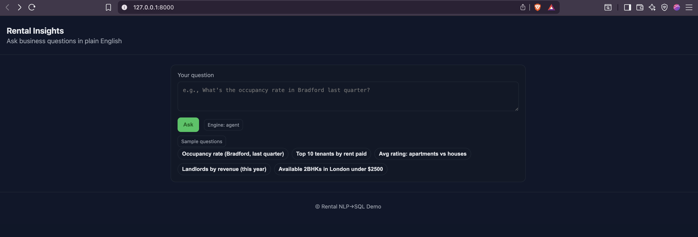
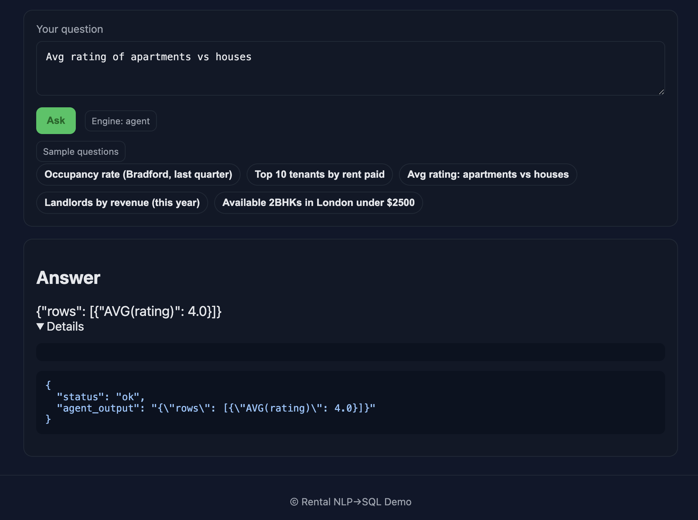
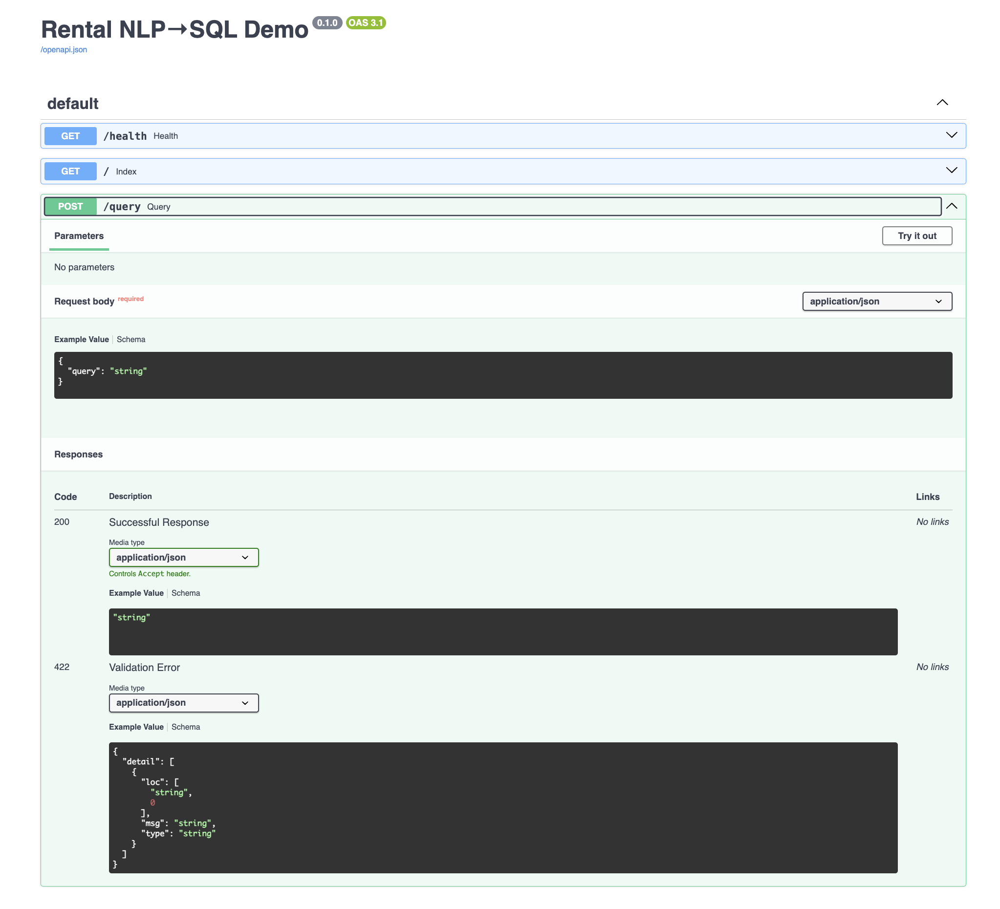

# Rental NLP → SQL Demo (POC)

>A Proof-of-Concept project that demonstrates how natural language questions can be converted to SQL queries over a rental marketplace database, with answers returned via a web API and UI. This document explains the architecture, technologies, workflow, and provides a user guide for running and evaluating the POC.

---

## Table of Contents
1. [Project Overview](#project-overview)
2. [Architecture & Technologies](#architecture--technologies)
3. [Workflow](#workflow)
4. [User Guide](#user-guide)
5. [API Reference](#api-reference)
6. [Evaluation](#evaluation)
7. [Repo Structure](#repo-structure)
8. [Notes](#notes)
9. [License](#license)

---

## Project Overview

This POC enables users to ask business questions about a rental marketplace in plain English. The system translates these questions into SQL, executes them on a local SQLite database, and returns the results. It supports multiple NL→SQL engines: rule-based templates, HuggingFace models, and agentic LLMs via smolagents.

Here are a few screenshots of the project in action:

- **Home Page**
  

- **Query Input & Results**
  

- **Swagger API Docs**
  

---

## Architecture & Technologies

- **Language:** Python 3.10+
- **Framework:** FastAPI (API & web server)
- **Database:** SQLite (auto-initialized from `data/rental_app.sql`)
- **NL→SQL Engines:**
  - Rule-based templates (default)
  - HuggingFace text-generation model (optional)
  - Agentic LLM via [smolagents](https://github.com/smol-ai/smolagents) (optional)
- **Frontend:** Simple web UI (HTML/CSS/JS)
- **Evaluation:** Automated test suite and accuracy report

---

## Workflow

1. **User submits a question** via the web UI or API (e.g., "Top 10 tenants by rent paid").
2. **NL→SQL engine** parses the question and generates a SQL query.
3. **Database connector** executes the SQL on the local SQLite DB.
4. **Result** is formatted and returned to the user (web UI or API response).
5. **Fallback**: If the question is unsupported, a graceful message is returned.

---

## User Guide

### 1. Setup

#### a) Create and activate a virtual environment
```bash
python3 -m venv .venv
source .venv/bin/activate
```

#### b) Install dependencies
```bash
pip install -r requirements.txt
```

#### c) Configuration (optional)
- Edit `config.yaml` to change engine or DB path. Default engine is `rule_based`.
- To use HuggingFace or agentic mode, set `nlp_to_sql.engine` to `hf` or `agent` and provide model details.

#### d) Initialize the database
- On first run, the app auto-creates `data/rental_app.db` from `data/rental_app.sql`.

### 2. Running the API Server
```bash
uvicorn src.app:app --reload
```
- **Swagger UI:** [http://127.0.0.1:8000/docs](http://127.0.0.1:8000/docs)
- **Frontend UI:** [http://127.0.0.1:8000/](http://127.0.0.1:8000/)

### 3. Agentic Mode (LLM)
- Create `.env` with `HF_TOKEN=...` (see `.env.example`)
- Set `nlp_to_sql.engine: agent` in `config.yaml`
- Restart the server

---

## API Reference

- `GET /health` — Health check
- `POST /query` — Submit a natural language question
  - **Request body:** `{ "query": "Your question" }`
  - **Response:**
    - Success (rule_based/hf): `{ "sql": "...", "result": <number|list>, "status": "ok" }`
    - Success (agent): `{ "agent_output": "...", "status": "ok" }`
    - Fallback: `{ "message": "Sorry, unable to answer at this point in time.", "status": "fallback" }`

**Example:**
```bash
curl -X POST http://127.0.0.1:8000/query \
  -H 'Content-Type: application/json' \
  -d '{"query": "What is the occupancy rate of properties in Bradford last quarter?"}'
```

---

## Evaluation

Automated evaluation against `data/test_queries.json`:
```bash
python -m src.evaluator --test-file data/test_queries.json
```
- Computes SQL exact-match and execution accuracy
- Numeric answers are compared with tolerance
- Results are written to `report/accuracy_report.md`

---

## Repo Structure

- `README.md` — Project documentation
- `requirements.txt` — Python dependencies
- `config.yaml` — Configuration (DB, engine, models)
- `data/`
  - `rental_app.sql` — DB schema & seed data
  - `test_queries.json` — Evaluation queries
- `src/`
  - `app.py` — FastAPI app & endpoints
  - `nlp_to_sql.py` — NL→SQL engines
  - `db_connector.py` — DB initialization & query execution
  - `evaluator.py` — Evaluation CLI
  - `utils.py` — Helpers (config, formatting, date windows)
  - `agentic.py` — Agentic LLM integration
- `notebooks/`
  - `exploratory.ipynb` — Data exploration
- `report/`
  - `accuracy_report.md` — Evaluation results
- `tests/`
  - `test_app.py` — API endpoint tests
  - `test_nlp_to_sql.py` — NL→SQL tests
  - `conftest.py` — Test config
- `templates/` & `static/` — Web UI (HTML, CSS, JS)
- `scripts/` — Helper scripts (`run_api.sh`, `eval.sh`)

---

## Notes

- **Modes:**
  - `rule_based`: Deterministic templates for demo queries (default)
  - `hf`: Direct text-to-SQL using a HuggingFace model
  - `agent`: Agentic SQL via smolagents with schema-aware tool and iterative refinement
- Configure engine in `config.yaml` under `nlp_to_sql.engine`
- Unsupported questions return a fallback message